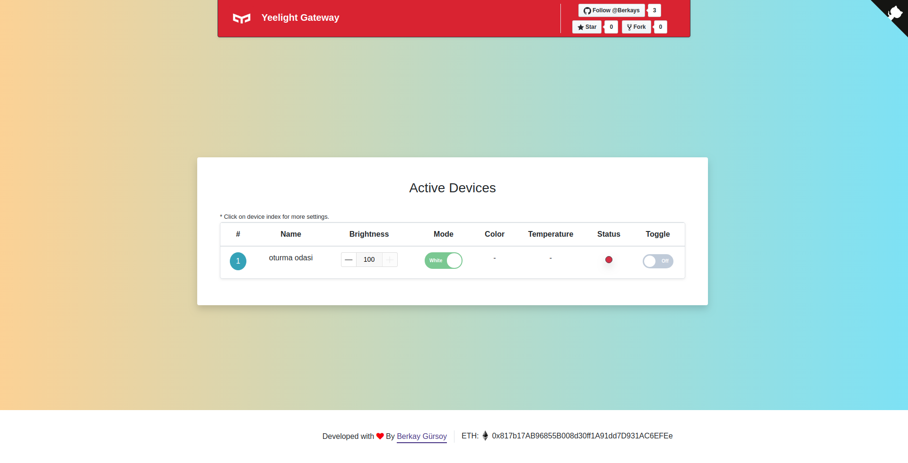

# Yeelight Gateway
> Web application to easily manage your yeelight devices in local network.

[![Build Status][travis-image]][travis-url]



## Installation

Make sure you have NodeJS installed.

Clone this repository:
```
git clone https://github.com/Berkays/YeelightGateway.git
```

Install dependeceies:
```
npm install
```

Build application:
```
npm run build
```

Create your .env enviroment variable files in the root directory of the project. Sample .env file can be found in [.env.example](.env.example)

## Usage

After building the application with `npm run build`, make sure your yeelight devices have lan control enabled from the yeelight mobile application.

Run the application with `npm run start`.

## Yeelight Specification

[https://www.yeelight.com/download/Yeelight_Inter-Operation_Spec.pdf](https://www.yeelight.com/download/Yeelight_Inter-Operation_Spec.pdf)

## TODO

- [ ] Device details modal 
- [ ] More unit tests
- [ ] Per device state cache
- [ ] Yeelight music mode

## Release History

* 0.0.1
    * Initial Commit

## Contributing

1. Fork it (<https://github.com/Berkays/YeelightGateway/fork>)
2. Create your feature branch (`git checkout -b feature/newFeature`)
3. Commit your changes (`git commit -am 'Add new feature'`)
4. Push to the branch (`git push origin feature/newFeature`)
5. Create a new Pull Request

<!-- Markdown link & img dfn's -->
[travis-image]: https://travis-ci.org/Berkays/YeelightGateway.svg?branch=master
[travis-url]: https://travis-ci.org/Berkays/YeelightGateway

## Meta

Berkay GURSOY – berkaygursoy@gmail.com

Distributed under the MIT license. See ``LICENSE`` for more information.

[https://github.com/Berkays/YeelightGateway](https://github.com/Berkays/YeelightGateway)

### Donate

You can donate to my ethereum address to support me.

ETH: <i>0x817b17AB96855B008d30ff1A91dd7D931AC6EFEe</i>